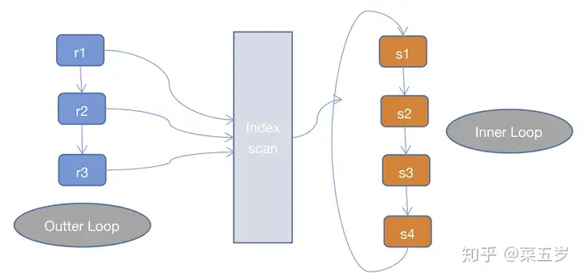

join有三种算法，分别是`Nested Loop Join，Hash join，Sort Merge Join`

MySQL官方文档中提到，MySQL只支持`Nested Loop Join`这一种join algorithm
> MySQL resolves all joins using a nested-loop join method. This means that MySQL reads a row from the first table, and then finds a matching row in the second table, the third table, and so on.<br/>[explain-output](8.8.2 EXPLAIN Output Format)

所以先讨论`Nested Loop Join`
NLJ是通过两层循环，用第一张表做`Outter Loop`，第二张表做`Inner Loop`，`Outter Loop`的每一条记录跟`Inner Loop`的记录作比较，符合条件的就输出，而NLJ又有3中细分的算法：

**1.Simple Nested Loop Join(SNLJ)**
```
for(r in R)
{
    for(s in S)
    {
        if(r satify condition s)
        {
            output <r, s>;
        }
    }
}
```

SNLJ就是两层循环全量扫描连接的两张表，得到符合条件的两条记录则输出，其实就是让两张表做笛卡尔积，比较次数是R*S，是暴力求解，非常耗时

**2.Index Nested Loop Join(INLJ)**
```
for(r in R)
{
    for(si in SIndex)
    {
        if(r satisfy condition si)
        {
            output<r, s>;
        }
    }
}
```

INLJ是在SNLJ的基础上做了优化，通过连接条件确定可用的索引，在Inner Loop中扫描索引而不去扫描数据本身，从而提高Inner Loop的效率

但INLJ也有缺点，如果扫描的索引是非聚簇索引，并且需要访问非索引的数据，会产生一个回表读取数据的操作，这就多了一次随机的I/O操作

**Block Nested Loop Join(BNLJ)**
一般情况下，MySQL优化器在索引可用的情况下，会优先选择使用INLJ算法，但是在无索引可用，或者判断full scan可能比使用索引更快的情况下，还是不会选择使用过于粗暴的SNLJ算法。

这里就出现了BNLJ算法了，BNLJ在SNLJ的基础上使用了join buffer，会提前读取Inner Loop所需要的记录到buffer中，以提高Inner Loop的效率。