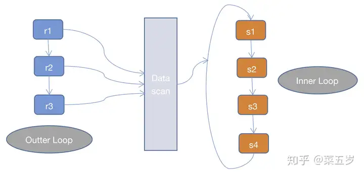

join有三种算法，分别是`Nested Loop Join，Hash join，Sort Merge Join`

## Nested Loop Join
MySQL官方文档中提到，MySQL只支持`Nested Loop Join`这一种join algorithm
> MySQL resolves all joins using a nested-loop join method. This means that MySQL reads a row from the first table, and then finds a matching row in the second table, the third table, and so on.<br/>[explain-output](8.8.2 EXPLAIN Output Format)

所以先讨论`Nested Loop Join`
NLJ是通过两层循环，用第一张表做`Outter Loop`，第二张表做`Inner Loop`，`Outter Loop`的每一条记录跟`Inner Loop`的记录作比较，符合条件的就输出，而NLJ又有3中细分的算法：

**1.Simple Nested Loop Join(SNLJ)**
```
for(r in R)
{
    for(s in S)
    {
        if(r satify condition s)
        {
            output <r, s>;
        }
    }
}
```

SNLJ就是两层循环全量扫描连接的两张表，得到符合条件的两条记录则输出，其实就是让两张表做笛卡尔积，比较次数是R*S，是暴力求解，非常耗时

**2.Index Nested Loop Join(INLJ)**
```
for(r in R)
{
    for(si in SIndex)
    {
        if(r satisfy condition si)
        {
            output<r, s>;
        }
    }
}
```

INLJ是在SNLJ的基础上做了优化，通过连接条件确定可用的索引，在Inner Loop中扫描索引而不去扫描数据本身，从而提高Inner Loop的效率

但INLJ也有缺点，如果扫描的索引是非聚簇索引，并且需要访问非索引的数据，会产生一个回表读取数据的操作，这就多了一次随机的I/O操作

**Block Nested Loop Join(BNLJ)**
一般情况下，MySQL优化器在索引可用的情况下，会优先选择使用INLJ算法，但是在无索引可用，或者判断full scan可能比使用索引更快的情况下，还是不会选择使用过于粗暴的SNLJ算法。

将外层循环的行/结果集存入join buffer, 内层循环的每一行与整个buffer中的记录做比较，从而减少内层循环的次数. 举例来说，外层循环的结果集是100行，使用NLJ 算法需要扫描内部表100次，如果使用BNL算法，先把对Outer Loop表(外部表)每次读取的10行记录放到join buffer,然后在InnerLoop表(内部表)中直接匹配这10行数据，内存循环就可以一次与这10行进行比较, 这样只需要比较10次，对内部表的扫描减少了9/10。所以BNL算法就能够显著减少内层循环表扫描的次数. 
```
for(r in R)
{
    for(sbu in SBuffer)
    {
        if(r satisfy condition sbu)
        {
            output<r, s>;
        }
    }
}
```


MySQL中控制join buffer大小的参数名是join_buffer_size

根据MySQL手册中的说法，join_buffer_size缓冲的是被使用到的列

MySQL 5.6版本及以后，优化器管理参数optimizer_switch中的block_nested_loop 参数控制着BNL是否被用于优化器。默认条件下是开启，若果设置为off，优化器在选择 join方式的时候会选择NLJ算法


**算法比较(外表大小R, 内表大小S)：**


在MySQL5.6中，对INLJ的回表操作进行了优化，增加了Batched Key Access Join（批量索引访问的表关联方式，这样翻译可以不。。。）和Multi Range Read（mrr，多范围读取）特性，在join操作中缓存所需要的数据的rowid，再批量去获取其数据，把I/O从多次零散的操作优化为更少次数批量的操作，提高效率。


## Hash Join
Hash join散列连接是CBO 做大数据集连接时的常用方式，优化器使用两个表中较小的表（通常是小一点的那个表或数据源）利用连接键（JOIN KEY）在内存中建立散列表，将列数据存储到hash列表中，然后扫描较大的表，同样对JOIN KEY进行HASH后探测散列表，找出与散列表匹配的行。需要注意的是：如果HASH表太大，无法一次构造在内存中，则分成若干个partition，写入磁盘的temporary segment，则会多一个写的代价，会降低效率。

这种方式适用于较小的表完全可以放于内存中的情况，这样总成本就是访问两个表的成本之和。但是在表很大的情况下并不能完全放入内存，这时优化器会将它分割成若干不同的分区，不能放入内存的部分就把该分区写入磁盘的临时段，此时要有较大的临时段从而尽量提高I/O 的性能

## Sort Merge Join
排序合并连接是先将关联表的关联列各自做排序，然后从各自的排序表中抽取数据，到另一个排序表中做匹配

通常情况下Hash Join的效果都比排序合并连接要好，然而如果两表已经被排过序，在执行排序合并连接时不需要再排序了，这时Merge Join的性能会优于Hash Join。Merge join的操作通常分三步：
　　1. 对连接的每个表做table access full;
　　2. 对table access full的结果进行排序。
　　3. 进行merge join对排序结果进行合并。
在全表扫描比索引范围扫描再进行表访问更可取的情况下，Merge Join会比Nested Loop性能更佳。当表特别小或特别巨大的时候，实行全表访问可能会比索引范围扫描更有效。